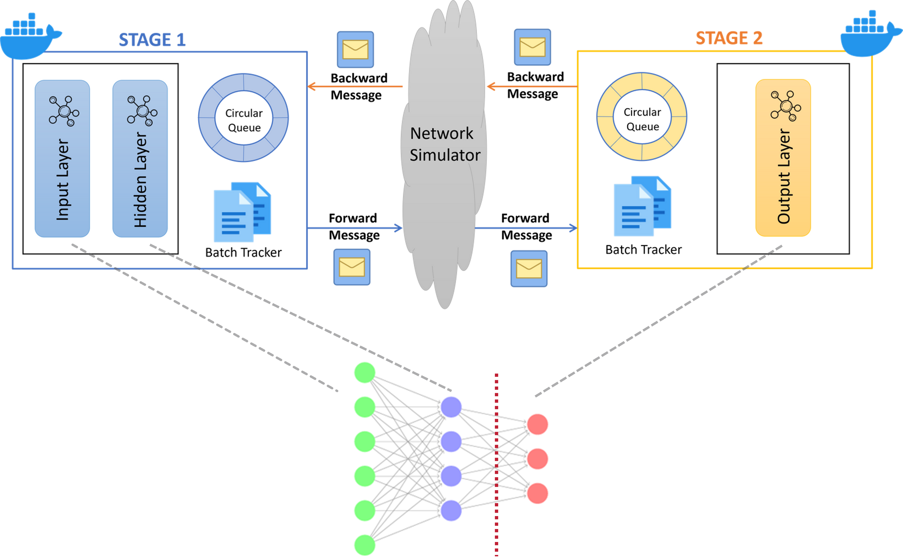

# Pipeline Parallelism Neural Network Training System

## 🎯 Overview

This repository implements a **distributed pipeline parallelism system** for neural network training, specifically designed for academic research and performance analysis. The system demonstrates advanced parallel computing techniques for deep learning workloads with comprehensive performance metrics collection.

### Key Features

- **🔄 Two-Stage Pipeline Architecture**: Input→Hidden→Output layer processing
- **⚡ Asynchronous Processing**: Non-blocking forward and backward pass execution
- **📊 Adaptive Scaling**: Dynamic batch size adjustment based on pipeline performance
- **🌐 Network-Aware**: Supports LAN/WAN deployment with network condition adaptation
- **📈 Comprehensive Metrics**: Real-time performance monitoring and analysis
- **🐳 Docker-Ready**: Containerized deployment with orchestration support

### Architecture

<div align="center">
  
  <p><i>Pipeline Parallelism Neural Network Training System Architecture</i></p>
</div>

The system implements a **two-stage pipeline architecture** with asynchronous processing:

- **Stage 1**: Transforms input data (784 features) to hidden layer (512 units) using sigmoid activation
- **Stage 2**: Processes hidden layer output (512 units) to final classification (10 classes) using softmax
- **Asynchronous Communication**: Forward and backward passes operate concurrently with buffered message passing
- **Adaptive Optimization**: Dynamic batch sizing and pipeline depth adjustment based on performance metrics

## 📁 Project Structure

```
pipeline-parallelism-improve/
├── pipeline/                      # Core pipeline implementation
│   ├── pipeline_main.c           # Main pipeline stages implementation
│   ├── pipeline_nn.h             # Neural network data structures & APIs
│   ├── stage.c                   # Neural network stage processing
│   ├── buffer.c                  # Thread-safe message queues
│   ├── message.c                 # Network communication protocols
│   ├── adaptive_scaling.c        # Dynamic performance optimization
│   ├── metrics_collector.c       # Performance metrics collection
│   ├── metrics_tracking.c        # Real-time metrics tracking
│   └── metrics_*.h               # Metrics header files
├── matrix/                       # Matrix operations library
│   ├── matrix.c                  # Core matrix operations
│   ├── ops.c                     # Standard matrix operations
│   └── ops_optimized.c           # Optimized matrix operations
├── neural/                       # Neural network components
│   ├── nn.c                      # Neural network implementation
│   └── activations.c             # Activation functions
├── socket/                       # Network communication
│   └── socket_utils.c            # Socket utilities and protocols
├── util/                         # Utility functions
│   └── img.c                     # Image processing for MNIST
├── data/                         # Dataset storage
│   ├── mnist_train.csv           # MNIST training dataset
│   └── mnist_test.csv            # MNIST testing dataset
├── docker-compose-pipeline.yml   # Docker orchestration configuration
├── env.wan                       # WAN environment configuration
├── env.lan                       # LAN environment configuration
├── Dockerfile                    # Container build configuration
├── Makefile                      # Build system
└── README.md                     # This file
```

### Core Components

#### 🧠 Neural Network Pipeline
- **Stage 1**: Input layer (784) → Hidden layer (512) with sigmoid activation
- **Stage 2**: Hidden layer (512) → Output layer (10) with softmax activation
- **Asynchronous Processing**: Concurrent forward and backward pass execution
- **Batch Tracking**: Pipeline depth management with out-of-order gradient handling

#### 📊 Performance Optimization
- **Adaptive Batch Sizing**: Dynamic adjustment based on pipeline bubble rate
- **Pipeline Depth Control**: Automatic depth adjustment for optimal throughput
- **Network Condition Awareness**: Latency and bandwidth adaptive processing
- **Bubble Rate Monitoring**: Real-time pipeline efficiency tracking

#### 🔧 System Components
- **Thread-Safe Buffers**: Circular queue implementation with retry mechanisms
- **Network Communication**: TCP-based message passing with timeout handling
- **Metrics Collection**: Comprehensive performance data gathering
- **Docker Integration**: Multi-container deployment with network isolation

## 🚀 Quick Start

### Prerequisites

- Docker and Docker Compose
- 4GB+ RAM recommended
- Multi-core CPU for optimal performance

### Running the System

#### 1. WAN Environment (Simulated Wide Area Network)
```bash
# Start the pipeline system in WAN mode
docker-compose -f ./docker-compose-pipeline.yml --env-file ./env.wan up
```

#### 2. LAN Environment (Local Area Network)
```bash
# Start the pipeline system in LAN mode
docker-compose -f ./docker-compose-pipeline.yml --env-file ./env.lan up
```

#### 3. Development Mode
```bash
# Build and run with verbose output
docker-compose -f ./docker-compose-pipeline.yml --env-file ./env.wan up --build
```

### 📊 Monitoring Output

The system provides real-time metrics output:

```
[STAGE1] Training started with adaptive pipeline...
[STAGE2] Connected to Stage 1. Ready for training...
[COORDINATOR] Performance monitoring active...
METRIC_LOG|1699123456|QUEUE_SIZE|3|1|45|0
METRIC_LOG|1699123457|BUBBLE_RATE|0.0234|2|85|0
METRIC_LOG|1699123458|OUT_ORDER|42|40|1|0
```

### 🛑 Stopping the System

```bash
# Graceful shutdown
docker-compose -f ./docker-compose-pipeline.yml down

# Force stop and cleanup
docker-compose -f ./docker-compose-pipeline.yml down -v
```

## 📈 Performance Analysis

### Key Metrics Collected

- **Pipeline Efficiency**: Utilization percentage of pipeline stages
- **Throughput**: Samples processed per second
- **Bubble Rate**: Pipeline stall frequency
- **Communication Overhead**: Network latency impact
- **Memory Usage**: Peak memory consumption
- **Load Balance**: Stage processing time ratio


## 🔬 Research Applications

This system is designed for academic research in:

- **Distributed Deep Learning**: Pipeline parallelism performance analysis
- **Network-Aware Computing**: Impact of network conditions on training
- **Adaptive Systems**: Dynamic optimization in distributed environments
- **Performance Modeling**: Scalability analysis and bottleneck identification


